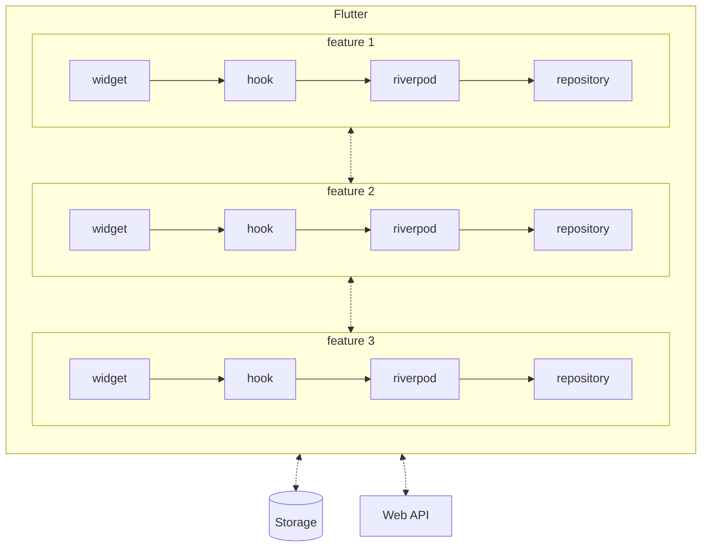

# アプリケーションアーキテクチャ

## 構成図



## ディレクトリ・ファイル構成

```
.
├── assets
│   ├── images
│   └── icons
├── dart_define
│   ├── prod.json
│   └── staging.json
├── lib
│   ├── main.dart
│   ├── app_root.dart
│   ├── config
│   │   ├── app_config.dart
│   │   ├── app_constant.dart
│   │   ├── i18n
│   │   └── theme
│   ├── feature
│   │   ├── <feature>
│   │   │   ├── dto
│   │   │   ├── entity
│   │   │   ├── enum
│   │   │   ├── exception
│   │   │   ├── hook
│   │   │   ├── repository
│   │   │   ├── riverpod
│   │   │   └── widget
│   │   ├── <feature>
│   │   │   ├── dto
│   │   │   ├── entity
│   │   │   ├── enum
│   │   │   ├── exception
│   │   │   ├── hook
│   │   │   ├── repository
│   │   │   ├── riverpod
│   │   │   └── widget
│   │   └── <feature>
│   │       ├── dto
│   │       ├── entity
│   │       ├── enum
│   │       ├── exception
│   │       ├── hook
│   │       ├── repository
│   │       ├── riverpod
│   │       └── widget
│   ├── dto
│   ├── enum
│   ├── exception
│   ├── extension
│   ├── hook
│   ├── riverpod
│   └── widget
└── test
```

## ディレクトリ・ファイル内容

### assets

- 画像やアイコンなどを格納
- [FlutterGen](https://github.com/FlutterGen/flutter_gen)を利用し、格納されているファイルパスを取得する

### dart_define

- 秘匿情報や Android, iOS の build に必要な情報を記載
- 秘匿情報を含むため git 管理せず、サンプルファイルのみ格納
- ref: [Dart-define-from-file を使って開発環境と本番環境を分ける](https://zenn.dev/altiveinc/articles/separating-environments-in-flutter)

### lib/main.dart

- Flutter のエントリーポイントとなる`main`メソッドを記載
- `MaterialApp`とは関係ない初期処理を行う
- 初期処理後、`runApp`で`AppRoot`を呼び出す

### lib/app_route.dart

- `MaterialApp`の呼び出し及び、それに必要な初期処理を行う

### config/app_config.dart

- アプリ全体で使用する設定を保持
- dart_define の情報は、こちらで取得して利用
- 秘匿情報ではない設定は、こちらに記載

### config/app_constant.dart

- アプリ全体で使用する定数を記載

### config/i18n

- 多言語用のファイルを格納
- ライブラリは、[slang](https://github.com/slang-i18n/slang)を使用

### config/theme

- テーマ定義を格納

### lib/feature/`<feature>`

- `<feature>`関心事でディレクトリを分割する
- Widget や Hook などの機能レイヤーは、その中で分割する

### lib/feature/`<feature>`/widget

- `<feature>`で利用利する Widget を格納
- 画面遷移処理やアクションなどのロジックは記載せず、Hook を呼び出す
- Riverpod は直接利用しない

### lib/feature/`<feature>`/hook

- `<feature>`で利用利する Hook を格納
- 画面遷移処理やアクションなどのロジックを記載
- Riverpod が管理している状態の取得・更新などを行う

### lib/feature/`<feature>`/riverpod

- Widget をまたぐ状態管理で利用する[Riverpod](https://riverpod.dev/)の処理を格納
- ストレージや Web API などと連携する Repository を呼び出す

### lib/feature/`<feature>`/repository

- ストレージや Web API などと連携

### lib/feature/`<feature>`/entity

- Reverpod, Hook, Widget でデータをやり取りするためのクラス

### lib/feature/`<feature>`/dto

- Repository でデータをやり取りするためのクラス

## ルール

### アーキテクチャ

- `<feature>`関心事でディレクトリを分割する
- 全体が対象・関心事にどうしても分割できない場合、`lib/`配下の機能レイヤーのディレクトリを利用する
- 機能レイヤーを飛び越えて呼び出し・利用しない
  - OK
    - Widget <--> Widget
    - Widget <--> Hook
    - Hook <--> Hook
    - Hook <--> Riverpod
    - Riverpod <--> Repository
  - NG
    - Widget <--> Riverpod
    - Widget <--> Repository
    - Hook <--> Repository
