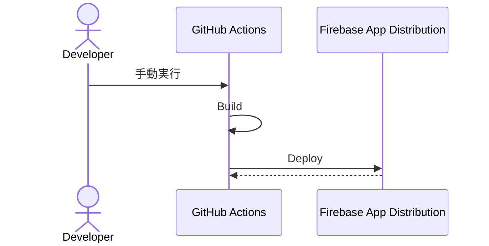
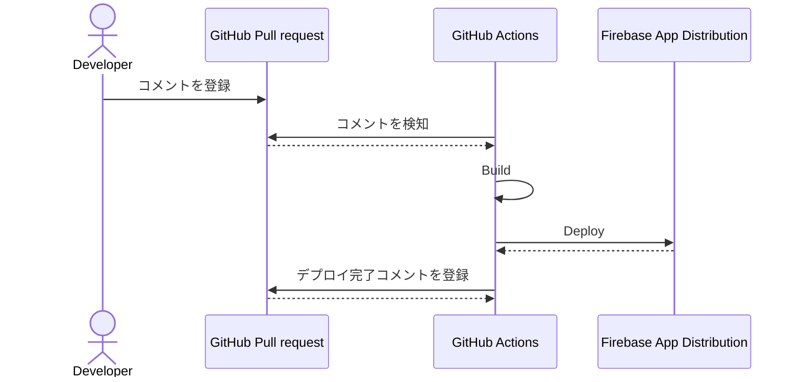
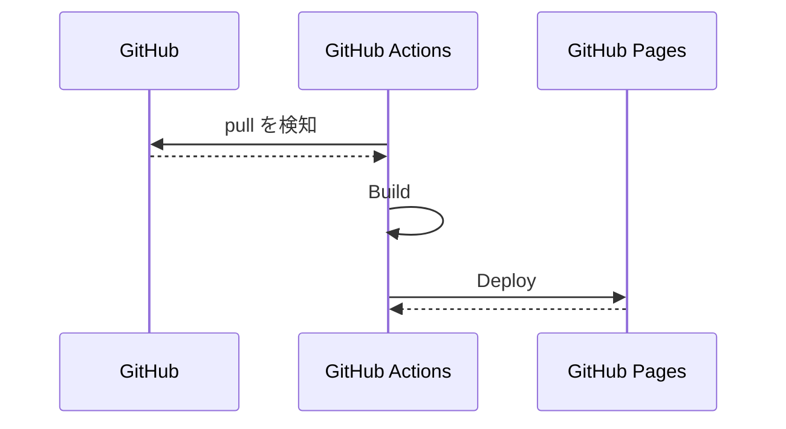

# 継続的デリバリー / Continuous Delivery (CD)

GitHub Actions を使用し、ビルド・デプロイなどを行う。

## Deploy Android (Stg)

Android (Stg) 向けにビルドを行い、 Firebase App Distribution へデプロイする。

### シーケンス図

#### 手動実行

#### Pull request に `/deploy_android_stg` コメントを登録

### 設定ファイル

[deploy_android_stg.yml](../../.github/workflows/deploy_android_stg.yml)

### 実行タイミング

- 手動実行 (workflow_dispatch)
- Pull Request へ `/deploy_android_stg` コメントを登録

### Secrets, Variables 設定

#### Repository secrets

| Name | 設定内容 | 備考 |
| --- | --- | --- |
| ANDROID_KEYSTORE_JKS | `android/app/upload-keystore.jks` ファイルを base64 でエンコードした文字列  |  |
| ANDROID_KEY_PROPERTIES | `android/app/key.properties` ファイルを base64 でエンコードした文字列 |  |
| DART_DEFINE_FILE_STG_JSON | `dart_define/stg.json` ファイルを base64 でエンコードした文字 |  |
| DEPLOY_ANDROID_STG_FIREBASE_CLI_TOKEN | `firebase login:ci` で取得したトークン |  |
| FIREBASE_STG_GOOGLE_SERVICE_JSON | `android/app/src/stg/google-services.json` ファイルを base64 でエンコードした文字 |  |

#### Repository variables

| Name | 設定内容 | 備考 |
| --- | --- | --- |
| DEPLOY_ANDROID_STG_APP | Firebase プロジェクトの設定 > マイアプリ > Android アプリ > アプリ ID |  |
| DEPLOY_ANDROID_STG_TESTER_GROUPS | Firebase App Distribution テスターグループ |  |

## Deploy GitHub Pages

README や doc, Widgetbook を GitHub Pages へデプロイする。

### シーケンス図

### 設定ファイル

[deploy_github_pages.yml](../../.github/workflows/deploy_github_pages.yml)

### 実行タイミング

- develop ブランチへ push

### Secrets, Variables 設定

なし
