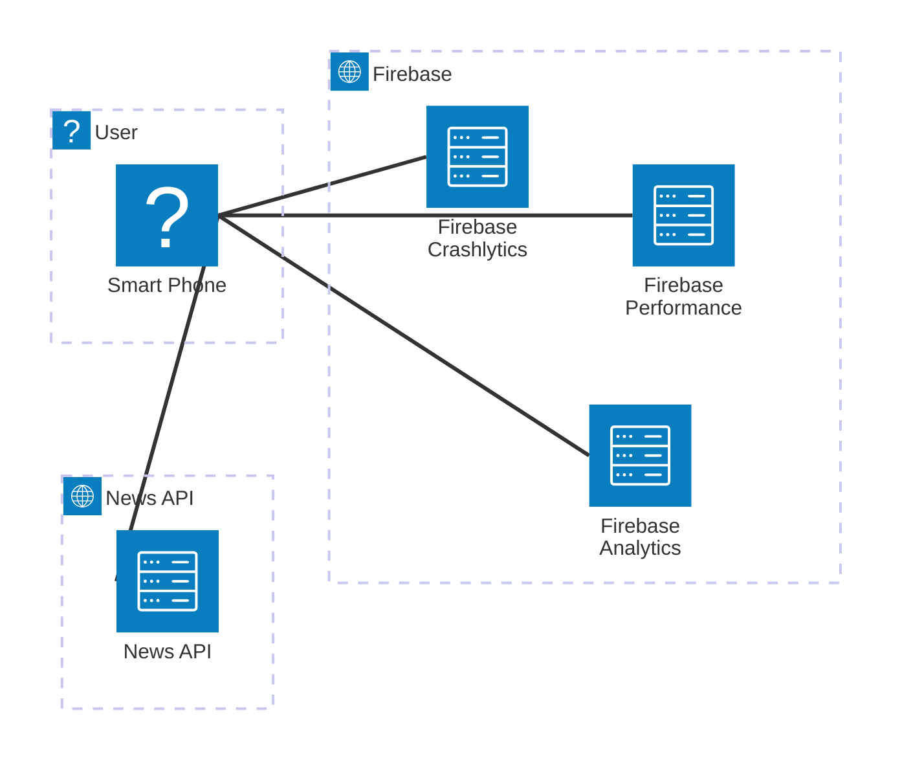

# インフラ

## 構成図

```mermaid
architecture-beta
  group group_user(user)[User]
  service smartphone(smeartphone)[Smart Phone] in group_user

  group group_news_api(internet)[News API]
  service news_api(server)[News API] in group_news_api

  group group_firebase(internet)[Firebase]
  service firebase_analytics(server)[Firebase Analytics] in group_firebase
  service firebase_crashlytics(server)[Firebase Crashlytics] in group_firebase
  service firebase_performance(server)[Firebase Performance] in group_firebase

  smartphone:R -- L:news_api
  smartphone:R -- L:firebase_analytics
  smartphone:R -- L:firebase_crashlytics
  smartphone:R -- L:firebase_performance
```